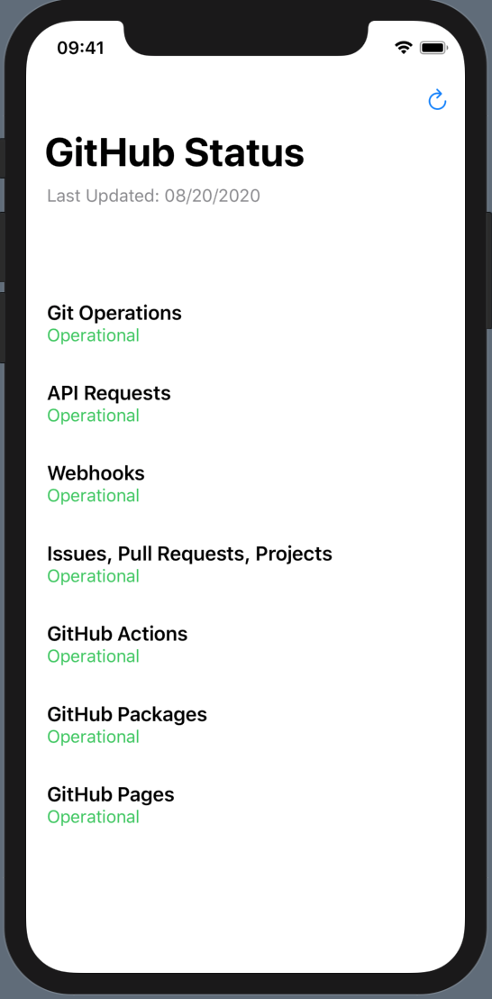

# 100Apps-11GitHubStatus

App 11 of my 100 App Challenge - https://github.com/Whoopinstick/100AppsChallenge

11 - GitHub Status

Written with SwiftUI

This app checks the status of operations at GitHub.  It uses their ‘summary’ API - https://www.githubstatus.com/api
I used the Codable protocol.  I parse and decode JSON with URLSession and JSONDecoder
I used DateFormatter and Calendar to change the appearance of the dates retrieved

